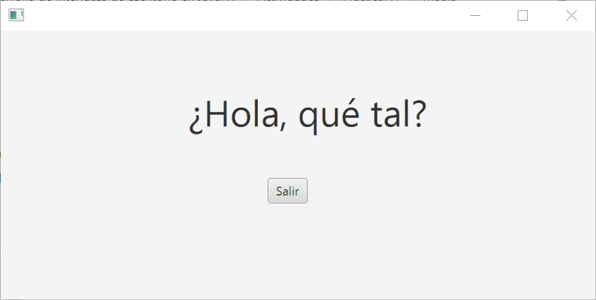
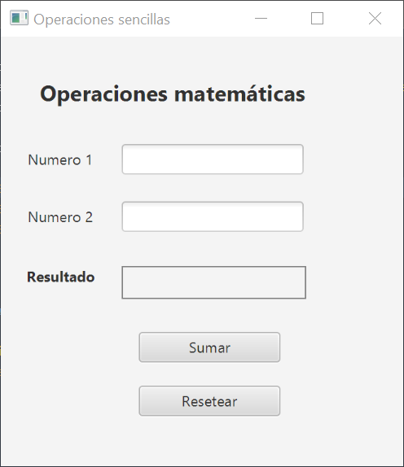

# Práctica 7.1 Introducción a JavaFX

## Parte 1

Crea un nuevo proyecto **JavaFX** (en Maven o Ant) siguiendo el MVC visto en clase con una ventana sencilla que tan solo salude al usuario y muestre un botón que muestre salir.

## Parte 2

A partir del proyecto anterior crea los siguientes componentes:

   -   Titula a la ventana 'Operaciones sencillas'
   -   Crea una **clase** para realizar operaciones matemáticas (en este caso solo la **suma**) dentro del **modelo**.
   -   Modifica la ventana (**vista** con la siguiente apariencia) y su **controlador** asociado, dándole como funcionalidad de suma de dos números que puedan tener decimales, así como una gestión básica de errores.

